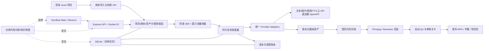

# Toonflow 自定义 AI 自动出片工作室实施计划

> 文档状态：待实施（本轮只制定计划，未创建分支、未修改业务代码、未调用任何付费 API）  
> 制定日期：2026-07-26  
> 主项目：`/Users/jiulongpopengyuyan/Desktop/cloudstar/project/ohter2/Toonflow-app`  
> 建议自定义分支：`custom-ai-video-studio`  
> 最终目标：以 Toonflow 为唯一部署和使用入口，吸收其他开源项目中真正能提高自动出片质量、可靠性和操作效率的能力。

## 1. 给执行 Codex 的任务定义

执行本计划时，不再把 ArcReel、OpenMontage、Huobao Drama 或 MoneyPrinterTurbo 部署成第二套产品，也不把多套系统拼成需要分别启动的微服务集合。Toonflow 是唯一主项目、唯一用户入口和唯一数据源；其他项目只作为架构、工作流、算法和交互参考。

完成后的主链应为：

```text
成品小说/剧本导入
  → 结构化剧本校验
  → 角色/场景/道具与衍生资产
  → 分镜与详细提示词编译
  → 图片/视频生成任务编排
  → 人工审核或自动选片/返工
  → 逐句配音、字幕与声音设计
  → 时间线编排和最终渲染
  → 自动 QA、交付与项目归档
```

交付标准不是“能拼出 MP4”，而是同时满足：

- 保留并增强 Toonflow 最有价值的导演 Skill、题材/画风知识、资产引用和一致性监督。
- 视频是真正由视频模型生成的动态镜头；素材检索只能作为明确标识的可选兜底，不能让主链退化成 PPT 或素材混剪。
- 批量任务可限流、可取消、可重试、可在应用重启后续跑，尽量避免重复提交和重复付费。
- 可以按角色逐句配音，生成准确字幕，并混合原生环境声、对白、BGM 等多条音轨。
- 可以从已审核镜头自动输出可发布的视频，并提供质量报告、成本记录和返工入口。
- 用户仍可在关键节点审核、换片和重生成，不以“无人值守”为理由牺牲最终质量。
- 完成后，未来 Codex 能依靠仓库内知识库回答“怎么操作、这个功能做什么、数据在哪里、失败了怎么办”。

## 2. 已知基线与实施日必须重验的事实

### 2.1 2026-07-26 的只读检查结果

| 项目 | 当前结果 |
|---|---|
| Toonflow-app 远端 | `https://github.com/HBAI-Ltd/Toonflow-app.git` |
| 默认分支 | `master` |
| 本地/远端 master | `bc61ec7a1b5df31293b286981a5f4ad4635464ee` |
| 最新 tag | `v1.1.8` |
| v1.1.8 实际提交 | `cd3e7c4e83963bea255be2e621eb78d2cd1c2188` |
| 祖先关系 | `v1.1.8` 是当前 `master` 的祖先 |
| 提交差距 | `master` 比 `v1.1.8` 领先 6 个提交 |
| 领先提交性质 | 只修改 README、翻译文档和图片，没有业务源码变化 |
| 远端 HEAD | 与 `refs/heads/master` 一致 |

结论：按当前状态，自定义分支应该从 `origin/master` 建立，而不是从 `v1.1.8` 建立。这样既包含正式版代码，也保留上游最新文档。但以上只是计划制定日的快照；真正实施前必须重新 fetch 并按下面流程判断，不能盲信本文中的提交号。

### 2.2 实施前基线检查（第一条强制关卡）

执行 Codex 应先只读检查并把结果写入 `IMPLEMENTATION_PROGRESS.md`：

```bash
cd /Users/jiulongpopengyuyan/Desktop/cloudstar/project/ohter2/Toonflow-app
git remote -v
git status --short --branch
git fetch origin --prune --tags
git remote show origin
git rev-parse origin/master
git tag --sort=-version:refname | head -n 20
git rev-list --left-right --count <latest-tag>...origin/master
git merge-base --is-ancestor <latest-tag> origin/master
git log --oneline --decorate <latest-tag>..origin/master
git diff --stat <latest-tag>..origin/master
```

判定规则：

1. 若最新 tag 是 `origin/master` 的祖先，且 master 有新增提交：从 `origin/master` 创建自定义分支。
2. 若 tag 与 master 指向同一提交：从 `origin/master` 创建。
3. 若最新 tag 领先 master，或二者出现分叉：暂停创建分支，检查 tag 是否为正式发布提交、默认分支是否变化、release 是否来自其他分支；将证据报告给用户后再决定。
4. 不以 tag 名称的字符串排序作为唯一依据；需要核对 GitHub Release、tag 创建时间、tag 指向提交和祖先关系。
5. 把最终选定的 Toonflow-app 上游 commit、tag、日期和判断依据记录在 `docs/upstream-baselines.md`。

### 2.3 当前工作区的特殊情况

计划制定时 `git status` 显示以下文件被修改：

- `data/vendor/grsai.ts`
- `data/vendor/null.ts`
- `data/vendor/volcengineSd2.ts`

逐文件比较工作区 `git hash-object` 与 HEAD blob 后内容完全一致，初步判断为 CRLF、文件模式或索引状态误报，不是真实代码修改。执行时仍需重新确认：

```bash
git diff --name-status
git diff --ignore-space-at-eol -- <file>
git hash-object <file>
git rev-parse HEAD:<file>
```

安全规则：

- 不得为了“变干净”直接使用 `git reset --hard`、`git checkout -- .`、`git clean -fd` 或覆盖文件。
- 如果存在任何真实内容修改，停止分支创建，让用户选择保留、提交、暂存或另建 worktree。
- 如果只有已证实的索引/换行误报，可优先安全刷新索引；仍无法消除时，使用从 `origin/master` 创建的独立干净 worktree，不触碰原文件。
- 创建分支前，把 `git status`、内容哈希核对结果和处理方式写入进度文档。

### 2.4 创建自定义分支

在上述关卡通过后才执行：

```bash
git switch -c custom-ai-video-studio origin/master
```

如果同名分支已经存在，不得覆盖或删除；先检查它与上游的关系和已有提交，再决定继续使用或请用户确认新名称。建议长期固定使用 `custom-ai-video-studio`，避免随日期不断新建分支。

## 3. 代码库组织决策：把正式前端源码纳入同一主项目

### 3.1 当前问题

Toonflow-app 中的 `data/web` 是编译产物，不是适合维护的前端源码。正式前端位于独立上游：

- 仓库：`https://github.com/HBAI-Ltd/Toonflow-web.git`
- 计划制定日远端 master：`9c4cb0ec7d4f6b4067c7768e2df8cdc7f8587214`
- 技术栈：Vue 3、TypeScript、Vite、Pinia、Vue Flow

本次改造包含任务中心、费用、配音、时间线、QA 和帮助系统等 UI，不能直接修改 `data/web` 中的压缩构建文件。

### 3.2 推荐方案

在里程碑 1 使用 `git subtree` 将 Toonflow-web 纳入 Toonflow-app 的 `frontend/`：

```text
Toonflow-app/
├── frontend/       # Toonflow-web 的可维护源码
├── src/            # 后端/Electron 源码
├── data/web/       # frontend 构建后的运行时产物
└── docs/
```

选择 subtree 的原因：用户最终只需要一个仓库、一个自定义分支、一个交付项目；同时还能保留 Toonflow-web 的上游提交来源。实施前应先验证前端版本与当前 `data/web` 是否匹配。

必须遵守：

- 第一次导入时记录 Toonflow-web 的远端、分支、commit 和 subtree 命令。
- 后续前端修改只在 `frontend/` 完成；通过固定脚本构建后同步至 `data/web`。
- 不手工编辑 `data/web`；构建产物是否提交沿用 Toonflow-app 现有发布方式。
- 增加 `frontend:install`、`frontend:dev`、`frontend:build`、`frontend:sync` 或等价脚本，并在文档说明用途。
- 如果 subtree 经验证与 Toonflow-app 的发布流程严重冲突，允许改用“仓库内 vendor 快照 + 明确上游元数据”，但必须先记录证据并征得用户同意，不能擅自退回双仓库日常开发。

## 4. 能力吸收边界和来源

### 4.1 吸收原则

- 吸收“能力和设计”，不是机械复制另一个项目的全部源码。
- 尽量使用 Toonflow 现有 TypeScript、Express、Socket.IO、Knex、SQLite、Vue 3 架构重写核心能力。
- 不把 ArcReel 的整套 Python/FastAPI/PostgreSQL、OpenMontage 的 Agent 工作目录或 Huobao 的整套服务直接塞入仓库。
- 第三方代码确需复用时，先检查许可证、依赖、运行时、维护成本和安全性，并记录来源 commit 与必要声明。虽然本地自用不按商业许可评分，代码来源仍必须可追溯。
- 新能力应通过稳定领域接口接入现有 Toonflow 流程，避免供应商细节渗透进 UI 和业务表。
- 保持现有项目、剧本、资产、分镜和供应商配置兼容；高风险新能力先用 feature flag 开启。

### 4.2 优先吸收清单

| 来源 | 应吸收的优势 | 在 Toonflow 中的落点 | 优先级 |
|---|---|---|---:|
| ArcReel | 持久队列、Worker lease、依赖、取消、重试、重启恢复 | 统一 `generation_tasks` 引擎 | P0 |
| ArcReel | 供应商并发池、RPM 限流、provider job ID、幂等 | Provider adapter + scheduler | P0 |
| ArcReel | 成本预估/实际费用、OpenAPI、API Key | 费用账本与自动化接口 | P1 |
| ArcReel | 项目版本、事件和回滚 | 资产版本与项目事件 | P1 |
| OpenMontage | FFmpeg/Remotion/HyperFrames 多级渲染 | Composition engine | P0/P1/P2 |
| OpenMontage | 多轨混音、响度、ducking、字幕和动态文字 | 规范化时间线与渲染模板 | P0/P1 |
| OpenMontage | 黑帧、冻结帧、静音、字幕安全区等 QA | 自动质量报告 | P1 |
| OpenMontage | 预算、审核关卡、模型质量/成本选择 | Policy engine | P1 |
| OpenMontage | 参考视频分析 | 可选风格/节奏参考分析 | P2 |
| Huobao Drama | 角色音色、试听、逐句 TTS、字幕 cue | Voice cast + utterance pipeline | P0 |
| Huobao Drama | 单镜头/整集合成入口 | Toonflow 工作台操作入口 | P0 |
| MoneyPrinterTurbo | 字幕样式、BGM、批量导出/打包 | 发布和包装体验 | P1 |
| MoneyPrinterTurbo | 本地或在线素材兜底 | 显式可选 fallback lane | P2 |
| 其他项目/实践 | 配置向导、诊断包、模板、批量操作 | 可运维性与易用性 | P1 |

### 4.3 明确不照搬的弱点

- 不采用 Huobao“一镜头一条大字幕、TTS 直接替换原音轨、简单 concat”的低质量实现。
- 不让 MoneyPrinterTurbo 的素材匹配成为默认镜头生产方式。
- 不依赖 OpenMontage“Codex/Claude 本身作为唯一运行时控制平面”的方式；产品运行时必须可独立完成队列和渲染。
- 不强制第一版迁移 PostgreSQL。优先让本地 SQLite 稳定工作，同时通过 repository/lease 抽象为以后部署 PostgreSQL 留接口。
- 不一次性接入所有供应商；先用统一能力模型封装现有供应商，再选择 1 个文本、1 个图像、1 个视频、1 个 TTS 适配器跑通。

### 4.4 编码前的补充调研关卡

其他项目在实施期间可能更新。里程碑 0 需要针对“自动出片”再做一次有界复核，但不得演变成无限调研：

1. 只复核候选项目最新默认分支、release 和与本计划相关的目录。
2. 建立 `docs/reference-capability-matrix.md`，每项记录来源仓库、commit、源码路径、优势、限制、是否吸收、Toonflow 落点。
3. 评估额外能力时采用五个门槛：是否提高成片质量、是否提高失败恢复、是否减少操作步骤、是否保持单项目、维护成本是否可控。
4. 新发现若只是“功能看起来多”，但不能满足上述门槛，不进入范围。
5. 任何会改变总体架构、数据库主引擎、主框架或部署形态的新发现，先作为变更提案报告用户，不得自行扩大范围。

参考目录（实施时先确认是否仍存在）：

```text
/Users/jiulongpopengyuyan/Desktop/cloudstar/project/ohter2/ArcReel
/Users/jiulongpopengyuyan/Desktop/cloudstar/project/ohter2/MoneyPrinterTurbo
/Users/jiulongpopengyuyan/Documents/Codex/2026-07-26/new-chat/work/repos/OpenMontage
/Users/jiulongpopengyuyan/Documents/Codex/2026-07-26/new-chat/work/repos/huobao-drama
```

### 4.5 长期能力雷达：参考项目不是一次性调研

ArcReel、OpenMontage、Huobao Drama、MoneyPrinterTurbo 以及以后确认有价值的项目，应登记为“参考上游”，持续观察其新能力；但它们与 Toonflow-app/Toonflow-web 的代码上游性质不同：

- **代码上游**：Toonflow-app、Toonflow-web，可以在审查后通过 merge/subtree 同步。
- **参考上游**：ArcReel 等项目，只扫描、分析和选择性重写能力，禁止自动 merge、cherry-pick 或覆盖 Toonflow 实现。

实施时建立以下长期资产：

```text
docs/upstream-watch/
├── README.md                         # 用户操作说明和评估规则
├── sources.yaml                      # 参考项目登记表和扫描游标
├── reports/                          # 每次扫描的增量报告
│   └── YYYY-MM-DD.md
└── decisions/                        # 每个候选能力的采纳/暂缓/拒绝记录
    └── <source>-<feature>.md
```

`sources.yaml` 至少记录：

```yaml
- id: arcreel
  repository: https://github.com/ArcReel/ArcReel.git
  local_path: /Users/jiulongpopengyuyan/Desktop/cloudstar/project/ohter2/ArcReel
  default_branch: main
  tracking_mode: reference-only
  relevant_areas:
    - task-engine
    - providers
    - cost-control
    - openapi
  last_scanned_commit: <commit>
  last_scanned_release: <tag-or-null>
  last_scanned_at: <ISO-8601>
  last_adopted_commit: <commit-or-null>
```

注意：默认分支只是示例字段，首次登记时必须根据远端实际状态填写；`last_scanned_commit` 与 `last_adopted_commit` 必须分开，不能把“看过”误写成“已吸收”。

## 5. 目标架构



建议新增或重构为以下模块边界，具体目录可在阅读现有架构后小幅调整，但职责不能混杂：

```text
src/
├── domain/                 # 项目、任务、时间线、费用等领域类型与规则
├── services/
│   ├── task-engine/        # 队列、lease、重试、限流、恢复
│   ├── providers/          # 统一能力接口和供应商适配器
│   ├── prompt-compiler/    # 分阶段提示词与模型约束编译
│   ├── voice/              # voice cast、TTS、字幕对齐
│   ├── composition/        # FFmpeg/Remotion 渲染
│   ├── quality/            # 媒体 QA 与评分
│   └── import/             # novel/通用剧本导入
├── routes/                 # 薄 API 层
├── workers/                # 后台 worker 入口
└── db/migrations/          # 可重复、可回滚的迁移
frontend/src/
├── views/tasks/
├── views/composition/
├── views/quality/
├── views/help/
└── stores/
```

## 6. 统一领域模型与数据库计划

在修改表前，先盘点所有现有表、路由和前端字段，输出 `docs/data-model-migration.md`。迁移必须保留现有数据，并准备备份/导出和向下兼容策略。

建议新增的核心表：

| 表 | 作用 | 关键字段示例 |
|---|---|---|
| `generation_tasks` | 所有异步生产任务 | `id, project_id, lane, type, status, priority, payload, result, attempts, max_attempts, lease_owner, lease_expires_at, next_run_at, provider, provider_job_id, idempotency_key, error_code` |
| `task_dependencies` | DAG 依赖 | `task_id, depends_on_task_id, requirement` |
| `provider_limits` | 每供应商/模型并发与 RPM | `provider, model, lane, max_concurrency, rpm, cooldown` |
| `provider_capabilities` | 模型能力目录 | 输入类型、时长、比例、参考数量、原生音频、轮询方式、价格版本 |
| `usage_ledger` | 预估与实际成本 | `task_id, provider, model, units, estimated_cost, actual_cost, currency, pricing_snapshot` |
| `asset_versions` | 图片/音频/视频版本及血缘 | `asset_id, version, parent_version_id, task_id, checksum, metadata, selected` |
| `voice_cast` | 角色与音色绑定 | `project_id, role_asset_id, provider, voice_id, settings, sample_asset_id` |
| `utterances` | 逐句对白/旁白 | `script_id, storyboard_id, speaker, text, order, emotion, pace, start_hint` |
| `subtitle_cues` | 字幕时间点 | `utterance_id, start_ms, end_ms, text, style_id, alignment_source` |
| `composition_jobs` | 渲染任务与模板 | `project_id, episode_id, timeline_version, renderer, preset, output_asset_id` |
| `quality_reports` | 自动检查结果 | `asset_id/job_id, check_type, severity, score, evidence, status` |
| `project_events` | 审计、版本和回滚线索 | `project_id, entity_type, entity_id, action, before, after, actor, created_at` |
| `api_keys` | 本地自动化调用凭证 | 仅保存哈希、scope、过期时间和最后使用时间 |

任务状态机统一为：

```text
queued → claimed → submitting → submitted → polling → finalizing → succeeded
              ↘ retry_wait ↗                  ↘ failed
queued/claimed/submitted → cancelling → cancelled
queued → blocked（依赖、预算或审核未满足）→ queued
```

任务 lane：

```text
text / image / video / audio / compose / qa / publish
```

状态机约束：

- 所有迁移通过显式函数校验，不允许任意字符串覆写状态。
- lease 到期后任务可被其他 worker 接管；提交阶段必须结合幂等键和 `provider_job_id` 防止重复计费。
- 供应商不支持幂等时，把“是否已经收到远端 job ID”作为高风险边界；无法确定时进入人工确认，不自动二次提交。
- payload 和 result 需要版本号，避免以后结构升级无法恢复旧任务。
- 错误分为可重试、不可重试、鉴权、余额/配额、内容安全、输入无效、供应商未知状态。
- 删除项目时不得静默删除仍在远端运行的付费任务；先取消或明确提示。

## 7. 分阶段实施计划与验收条件

### 里程碑 0：基线、分支和实施账本

任务：

1. 完成第 2 节全部上游、tag、工作区检查。
2. 从最终确认的 `origin/master` 建立 `custom-ai-video-studio`。
3. 创建 `IMPLEMENTATION_PROGRESS.md`，记录基线、决策、提交、验证、风险、下一步。
4. 创建 `docs/upstream-baselines.md` 和参考能力矩阵。
5. 盘点现有 API、Socket 事件、表、生成链、发布脚本和前端构建关系。
6. 给新能力定义 feature flags，例如 `durableTasks`、`compositionStudio`、`voicePipeline`、`qualityGate`、`openApi`。
7. 建立 `docs/upstream-watch/sources.yaml`，登记代码上游和参考上游的真实远端、默认分支、release、初始扫描 commit 与关注目录。

验收：

- 基线和分支来源可由 commit 复现。
- 用户原有真实修改未丢失。
- 没有调用付费 API。
- 已列出兼容性清单和高风险入口。

### 里程碑 1：纳入 Toonflow-web 并打通可维护构建

任务：

1. 核对 Toonflow-web 与当前 `data/web` 版本。
2. 通过 subtree 导入到 `frontend/`，记录上游 commit。
3. 固定 Node/Yarn 版本和安装方式，修正当前过宽的 engine 信息但避免无关升级。
4. 增加前后端开发、构建、同步脚本。
5. 确保 Electron 和浏览器模式仍能加载构建后的前端。
6. 写 `docs/frontend-upstream.md`，说明以后如何拉取 Toonflow-web 上游更新。

验收：

- `frontend/` 可独立 typecheck/build。
- 产物能被 Toonflow-app 正常加载。
- 未直接手改压缩后的 `data/web`。
- 原有登录、项目、剧本、资产、分镜、生成页面仍可打开。

### 里程碑 2：数据库迁移和统一领域层

任务：

1. 建立版本化迁移机制和 schema version。
2. 新增第 6 节核心表，优先完成任务、依赖、限制、费用、版本和事件表。
3. 为现有 `o_tasks` 提供兼容读取或一次性可回滚迁移，不让旧 UI 立即失效。
4. 定义 TypeScript/Zod 领域 schema、状态机和 repository 接口。
5. 增加数据库自动备份、迁移失败恢复说明。
6. 确保 SQLite 的事务、WAL、busy timeout 和并发写策略适合本地 worker。

验收：

- 一份现有 Toonflow 数据库副本能无损升级。
- 旧项目和资产仍可读取。
- 迁移重复执行安全，失败不会留下半迁移 schema。
- 数据库层不依赖某个具体云供应商。

### 里程碑 3：ArcReel 式持久任务引擎（最高优先级）

任务：

1. 用数据库 claim + lease 替换 `batchGenerateVideo.ts` 中 HTTP 返回后进程内 Promise 批量启动的核心方式。
2. 实现 worker 生命周期、心跳、lease 续期、超时接管和优雅关闭。
3. 实现任务 DAG、优先级、取消、可配置退避重试和死信/人工处理状态。
4. 实现按 lane、供应商和模型的并发池与 RPM token bucket。
5. 保存远端 `provider_job_id`，把 submit 与 poll 分离。
6. 实现应用重启扫描：恢复 polling、释放过期 lease、重排 retry_wait，不重复启动成功任务。
7. 生成稳定 `idempotency_key`，覆盖项目、实体、输入版本、模型和关键参数。
8. 通过 Socket.IO 向前端推送状态，但数据库是事实来源；断线重连后可全量补状态。
9. 让原图片/视频批处理路由逐步切到新引擎，保留短期兼容层。

验收：

- 中途强制关闭应用再启动，已获得 provider job ID 的任务继续轮询。
- 同一幂等请求不会创建两次远端提交。
- 并发和 RPM 在模拟供应商下严格受控。
- 可取消尚未提交、正在轮询和可被供应商取消的任务，并正确标记不可取消情况。
- 单个失败不会拖垮整批任务。
- UI 能解释当前状态、重试时间和失败原因。

### 里程碑 4：统一供应商能力目录、提示词编译和费用账本

任务：

1. 在现有可编辑 vendor 机制之上定义稳定 adapter：`validate → estimate → submit → poll/resume → cancel → normalizeResult`。
2. 统一描述文生视频、首帧图生视频、首尾帧、多参考图、视频/音频参考、原生音频等能力。
3. 建立模型参数约束：比例、分辨率、时长、参考数量、提示词长度、音频能力和区域可用性。
4. 增加 prompt compiler，把 Toonflow 导演结果编译为供应商具体提示词；保留原始意图、静态画面、动作、运镜、光影、声音和负面约束各字段，不能只存最终字符串。
5. 增加供应商选择策略：用户固定优先；自动模式再按能力、质量档、连续性支持、成本上限和近期错误率选择。
6. 价格表需版本化，任务提交时保存 pricing snapshot；预估与实际分别记录。
7. 密钥只通过现有安全配置或系统凭证读取，不写任务 payload、日志或知识库。
8. 首期只选少量代表 adapter 完整跑通，再扩展其他现有供应商。

验收：

- 不支持的参数会在付费提交前被拒绝并给出可操作提示。
- 每个任务可查看模型、参数、提示词版本、预估费用、实际费用和产物。
- 切换供应商无需修改业务页面数据结构。
- Mock adapter 可覆盖 submit/poll/resume/cancel 全流程。

### 里程碑 5：现有 novel 项目的成品剧本导入

任务：

1. 先取得 novel 项目真实导出样例或 API 契约；未知字段不得臆造。
2. 在 Toonflow 已有 `/api/script/addScript`、`/api/script/batchAddScript` 之上设计版本化导入 API。
3. 支持“仅校验/预览”模式：展示集、场、角色、对白、旁白、道具和无法识别字段，不立即写入。
4. 建立外部 ID 映射与幂等导入，同一版本重复导入不产生重复剧本。
5. 支持字段映射、分集拆分、角色别名合并和导入报告。
6. 保存原始输入摘要/校验和、导入器版本和转换警告。
7. UI 提供粘贴、文件上传和 API 三种入口；不强迫 Toonflow 再次改写已完成剧本。

验收：

- 一份多集成品剧本可预览后写入正确项目。
- 重复导入安全。
- 台词、角色归属和场次顺序不被悄悄修改。
- 失败时给出具体字段和修复建议。

### 里程碑 6：角色音色、逐句 TTS 和字幕时间轴

任务：

1. 从剧本/分镜提取 `utterances`，区分角色对白、旁白、群声和无台词镜头。
2. 建立角色到供应商音色的 `voice_cast`，支持试听、语速、音高、情绪和项目级默认值。
3. 每句 TTS 是独立可恢复任务；文本或声音参数未变化时复用缓存。
4. 优先使用供应商 word/phoneme 时间戳；没有时使用音频时长与可选强制对齐生成 cue。
5. 支持字幕断句、每行字数、阅读速度、样式、安全区和横竖屏模板。
6. 保留视频模型原生环境声，分别管理 dialogue、narration、SFX、ambience、BGM 音轨。
7. UI 能试听角色、单句重生成、手调 cue 和锁定已审核音频。

验收：

- 同一镜头可以有多句、多角色字幕，而非一镜头一条字幕。
- TTS 不会粗暴覆盖原视频音轨。
- 单句修改只重做受影响的音频和下游合成。
- 导出标准 SRT/VTT，并能在成片中选择软字幕或烧录字幕。

### 里程碑 7：FFmpeg 基础成片层（先完成可靠底座）

任务：

1. 定义与渲染器无关的规范化 timeline JSON：视频片段、裁剪点、转场、字幕、音轨、音量包络、画幅、帧率和色彩信息。
2. 实现媒体探测、代理文件和素材校验。
3. 用 FFmpeg 完成镜头裁剪、排序、基础转场、横竖屏适配、字幕、片头片尾和多轨混音。
4. 实现对白优先 ducking、响度标准化、true peak 限制、淡入淡出和缺失音轨处理。
5. 渲染命令由结构化参数构造，避免任意 shell 注入；日志需脱敏。
6. 产物带 timeline 版本、输入 checksum 和渲染 preset，可复现。
7. 提供镜头预览、整集低清预览和最终高质量渲染三档。

验收：

- 两个真实动态镜头、两句 TTS、环境声和 BGM 可自动输出 H.264/AAC MP4。
- 时长、音画同步、字幕位置和响度符合 preset。
- 同一 timeline 重渲染结果参数可复现。
- 某个镜头替换后只让相关下游任务失效。

### 里程碑 8：Remotion 高级包装；HyperFrames 延后评估

任务：

1. 在 FFmpeg 底座稳定后接入 Remotion，负责动态标题、复杂字幕、片头片尾、品牌模板和更灵活转场。
2. Remotion 与 FFmpeg 共享同一 timeline/domain，不建立第二套业务数据。
3. 建立模板清单、参数 schema、预览缩略图和版本。
4. 评估 OpenMontage 的 HyperFrames 场景；只有它能解决 Remotion/FFmpeg 无法低成本解决的明确需求时才纳入 P2。
5. 没有高级模板时必须能退回 FFmpeg 路径完成成片。

验收：

- 用户能选择基础和高级包装模板。
- 渲染器切换不会改变剧本、分镜和音频数据。
- 高级渲染失败可诊断，且不会破坏已完成的基础成片。

### 里程碑 9：自动 QA、预算和人工审核关卡

任务：

1. 媒体技术 QA：时长、分辨率、帧率、编码、损坏文件、黑帧、冻结帧、静音、削波、综合响度。
2. 版式 QA：字幕越界、安全区、阅读速度、片头片尾、横竖屏裁切。
3. 流程 QA：缺镜头、错误顺序、未选定资产、失败任务、临时素材、低清代理误用。
4. 可选语义 QA：人物/服装一致性、提示词符合度、动作完成度；模型评分只能辅助，不自动覆盖人工选择。
5. 预算关卡：项目/集/任务预算，提交前预估，接近或超过阈值时阻止并请求确认。
6. 审核关卡：角色资产、分镜图、视频候选、对白、低清成片、最终交付；每关可按项目配置。
7. 自动返工要有限次、有原因、有预算，不允许无限循环调用付费 API。

验收：

- 质量报告能从问题直接跳到对应镜头/字幕/任务。
- 阻断级问题不能被静默发布。
- 超预算不会自动付费继续生成。
- 用户能看见废片率、返工次数、可用镜头成本和整集总成本。

### 里程碑 10：统一操作界面

任务：

1. 新建任务中心：队列、运行中、等待重试、失败、阻塞、取消、费用和 worker 状态。
2. 在现有无限画布/工作台中显示任务与资产版本关系，不另造割裂产品。
3. 新建配音选角页、逐句音频/字幕编辑器。
4. 新建时间线/成片页：镜头顺序、音轨、字幕、模板、预览、渲染。
5. 新建 QA 与预算面板。
6. 新建供应商能力与限流配置，普通模式隐藏危险高级项。
7. 页面内嵌帮助链接到知识库对应条目。
8. 所有长任务由后端持久任务驱动；刷新页面不丢状态。

验收：

- 从剧本导入到最终 MP4 的关键路径不需要进入数据库或命令行。
- 每个失败状态有明确原因和下一步操作。
- 老用户在 feature flag 关闭时仍可使用原流程。
- Mac Electron 和浏览器 Web 两种入口均可用。

### 里程碑 11：OpenAPI、API Key、诊断与安全加固

任务：

1. 为项目、剧本导入、任务创建/查询/取消、费用、渲染和 QA 提供版本化 OpenAPI。
2. API Key 只保存哈希，支持 scope、撤销、过期和审计；本地 UI 与自动化调用权限分开。
3. 提供 webhook 或事件订阅，带签名、重试和去重。
4. 默认账号首次启动强制修改；密码使用安全哈希，不再明文存储。
5. 默认只监听本机；暴露到局域网/公网时给出醒目警告和反向代理/TLS 指南。
6. 日志脱敏 API Key、Authorization、签名 URL、原始供应商响应中的秘密字段。
7. 提供“诊断包”导出：版本、配置摘要、任务状态、脱敏日志、FFmpeg 探测、数据库 schema；不含密钥、生成内容和私人剧本，除非用户明确勾选。
8. 提供首次配置向导和无付费调用的供应商连通性检查。

验收：

- 外部脚本能通过 API 导入剧本、启动经授权的流程并查询状态。
- 未授权 scope 被拒绝。
- 诊断包经过秘密扫描。
- 默认安装不会意外向公网暴露服务。

### 里程碑 12：项目知识库/知识地图（必须与实现同步）

知识库不是最后临时补写。里程碑 2 起，每个功能提交必须同步元数据；本里程碑负责补齐、生成和验收。

最终至少包含：

```text
Toonflow-app/
├── AGENTS.md
├── PROJECT_GUIDE.md
└── docs/knowledge-hub/
    ├── README.md
    ├── AI_ASSISTANT_CONTEXT.md
    ├── architecture.md
    ├── workflows.md
    ├── feature-catalog.md
    ├── operations.md
    ├── troubleshooting.md
    ├── api-and-integration.md
    ├── database-and-tasks.md
    ├── providers-and-models.md
    ├── glossary.md
    ├── knowledge-map.yaml
    └── generated/
        ├── feature-index.md
        ├── route-index.md
        ├── data-index.md
        └── relation-map.md
docs/upstream-watch/
├── README.md
├── sources.yaml
├── reports/
└── decisions/
```

职责：

- `PROJECT_GUIDE.md`：给用户看的最短入口，包含第一次启动、典型操作、关键概念和文档导航。
- `AI_ASSISTANT_CONTEXT.md`：给未来 Codex 的快速上下文，说明先读哪些文件、如何定位功能、哪些内容由脚本生成。
- `feature-catalog.md`：逐项说明“功能解决什么、在哪里操作、输入输出、限制、失败怎么办”。
- `workflows.md`：剧本导入、角色资产、分镜、视频、配音、成片、返工、发布的操作流程。
- `operations.md`：安装、启动、升级、备份、恢复、worker、FFmpeg、日志和诊断。
- `troubleshooting.md`：按症状检索的排障树，必须给出安全命令和数据位置。
- `knowledge-map.yaml`：机器可读的项目关系图，是“类似知识图谱”的核心源文件。
- `docs/upstream-watch/`：长期扫描其他项目新能力，保存扫描游标、差异报告和采纳决策；不把外部项目变成运行时依赖。

`knowledge-map.yaml` 每个节点至少包含：

```yaml
id: feature.task-recovery
type: feature
name: 任务重启恢复
summary: 应用重启后根据 provider_job_id 继续轮询
user_entry:
  page: 任务中心
  action: 查看“恢复中”状态
source_paths:
  - src/services/task-engine/recovery.ts
api:
  - GET /api/v1/tasks/:id
tables:
  - generation_tasks
config:
  - taskEngine.leaseSeconds
relations:
  - type: uses
    target: concept.worker-lease
  - type: writes
    target: table.generation_tasks
troubleshooting:
  - docs/knowledge-hub/troubleshooting.md#任务一直停在恢复中
introduced_in: custom-ai-video-studio/<commit>
last_verified_commit: <commit>
```

节点类型至少覆盖：

```text
feature / page / workflow / api / socket-event / table / task-type /
provider / model-capability / config / script / document / troubleshooting
```

关系类型至少覆盖：

```text
uses / calls / reads / writes / depends_on / exposed_by /
configured_by / produces / consumes / documented_by / troubleshoots
```

增加脚本：

```text
yarn knowledge:build   # 从 YAML 和可发现源码生成索引/关系图
yarn knowledge:check   # 校验 ID、关系、文件路径、锚点、API/表引用和 commit 字段
yarn upstream:scan     # 只读获取参考上游增量并生成候选报告，不修改业务代码
yarn upstream:check    # 校验来源、扫描游标、报告和决策记录是否一致
```

根目录 `AGENTS.md` 应指示未来 Codex：

1. 回答项目问题前先读 `docs/knowledge-hub/README.md` 和相关专题。
2. 涉及具体行为时仍要核对当前源码，知识库不是源码的替代品。
3. 修改功能时同步更新知识节点和 `last_verified_commit`。
4. 优先用用户页面名称解释操作，再补充 API/源码位置。
5. 绝不在回答或诊断包中暴露密钥和私人剧本。

验收问题（未来 Codex 应能凭仓库回答）：

- “怎么把 novel 项目的成品剧本导入？”
- “为什么任务一直在 polling，重启会不会重复扣费？”
- “角色声音在哪里设置，能不能只重做一句？”
- “怎么保留视频环境声又加入对白和 BGM？”
- “这个镜头为什么没有进入最终成片？”
- “Seedance/Kling 等模型支持哪些参考输入？”
- “最终视频、字幕、日志和数据库分别在哪里？”
- “怎么备份、升级上游或回滚自定义版本？”

### 里程碑 13：稳定化、回归、发布和首条受控试片

任务：

1. 完成下节测试矩阵和兼容回归。
2. 新建干净数据目录执行首次安装、迁移、启动和一条无付费 fixture 流程。
3. 构建 macOS Electron 包和 Web 运行包，核对 FFmpeg/Remotion 依赖随包策略。
4. 生成版本说明、已知限制、迁移/回滚指南和上游同步说明。
5. 在用户明确批准供应商、模型和金额后，才执行 2～3 镜头真实 API 受控测试。
6. 记录镜头可用率、重生成次数、人物/服装一致性、动作完成度、字幕/对白、单可用镜头成本、整条耗时。
7. 真实测试暴露的问题修复后，再判断是否适合整集生成。

验收：

- 原 Toonflow 核心流程和新自动出片链都能工作。
- 应用重启、网络失败、供应商限流、渲染失败有可恢复路径。
- 用户能通过知识库完成一次完整操作并定位常见问题。
- 发布物不包含密钥、数据库、私人剧本、生成视频、缓存或开发依赖。

## 8. 测试与验证矩阵

这是跨数据库、任务、付费接口、音视频处理和前端的大型高风险改造，必须新增和运行针对性测试；但测试要分层，CI 绝不调用付费 API。

### 8.1 必需自动测试

- 任务状态机合法/非法迁移。
- claim、lease、心跳、过期接管和多 worker 竞争。
- 幂等键、submit/poll/resume/cancel Mock，尤其是“提交成功但写回 job ID 前进程崩溃”的不确定状态。
- 服务重启后的任务恢复。
- 供应商/模型并发和 RPM 限流。
- 退避、重试上限、依赖失败和取消传播。
- 费用预估、价格快照、实际费用和预算阻断。
- 数据库迁移、旧数据兼容和备份恢复。
- novel 剧本导入契约、预览和重复导入。
- 角色音色、逐句 TTS、字幕 cue 和缓存失效。
- 两镜头本地 FFmpeg fixture、多轨音频、ducking、响度和字幕。
- Remotion 模板 schema 和最小渲染。
- 黑帧、冻结帧、静音、响度、字幕安全区等 QA fixture。
- OpenAPI schema、鉴权 scope、webhook 签名和幂等。
- `knowledge-map.yaml` 的 ID、路径、链接、锚点和关系完整性。

### 8.2 集成与人工验收

- Electron 与浏览器 UI 冒烟。
- 旧项目数据库升级后核心页面回归。
- 页面刷新、Socket 断线重连和应用重启。
- 低磁盘空间、FFmpeg 缺失、文件路径含空格/中文、损坏媒体。
- Mac ARM64 为第一验证平台；后期机器确定后再补对应平台构建矩阵。
- 用 mock/本地 fixture 完成全链路，确认不会意外向云端发请求。
- 真实付费 API 测试必须逐次显示模型、镜头数、费用上限，等待用户明确授权。

### 8.3 质量门槛

每个里程碑至少执行：相关 typecheck/lint、窄测试、构建或本地 fixture，以及 `git diff --check`。重大里程碑结束再执行完整回归。不得为了追求数字覆盖率编写没有行为价值的测试；任务恢复、幂等和费用安全必须有高强度覆盖。

## 9. 费用、安全、隐私和文件纪律

执行 Codex 必须遵守：

- 未经用户当次明确批准，不调用任何会计费的文本、图片、视频、TTS 或分析 API。
- “已有 API Key”不等于获得付费调用授权。
- Mock、fixture 和本地 FFmpeg 测试必须默认阻断外网供应商调用。
- 不提交 `.env`、API Key、Cookie、数据库、签名 URL、私人小说/剧本、生成图片/音频/视频、日志、缓存、`node_modules`、构建临时目录。
- 更新 `.gitignore` 并在 CI/提交前做秘密与大文件检查。
- 媒体文件使用受控项目目录和内容哈希；删除时先确认不被其他版本引用。
- 数据库迁移和媒体清理前先提供可恢复备份。
- FFmpeg 参数、文件名、导入压缩包和供应商返回 URL 均按不可信输入处理。
- 对外监听、API Key、webhook 和诊断包采用最小权限和默认安全配置。

## 10. 提交、进度和范围控制协议

后续 Codex 执行时：

1. 一个里程碑拆成可审查的小批次提交；不要把数据库、任务引擎、UI 和文档塞进一个巨型提交。
2. 每完成一个批次更新 `IMPLEMENTATION_PROGRESS.md`：目标、修改文件、迁移、验证命令/结果、未决风险、下一步。
3. 每个里程碑结束先展示 diff 摘要和验收结果，再继续高风险下一阶段。
4. 不做与本计划无关的大规模格式化、依赖升级或重构。
5. 保持现有 API/UI 兼容；需要破坏性变更时先增加版本化接口和迁移期。
6. 任何付费调用、真实数据破坏、公开暴露服务、不可逆数据库操作，都必须单独取得用户授权。
7. 如果参考项目和计划描述不一致，以实际源码证据为准，并在进度文档记录差异与调整。
8. 如遇跨阶段阻塞，先完成不依赖该阻塞的文档、Mock、领域接口或 UI 骨架，但不得假装里程碑已验收。
9. 不把其他项目保留为运行时必需依赖；最终启动 Toonflow 即可使用所有已吸收能力。
10. 每次修改功能都同步知识库，避免最后集中补文档造成失真。

## 11. 上游同步策略

自定义分支必须能持续接收 Toonflow-app 和 Toonflow-web 的新功能。

### 11.1 Toonflow-app 上游

建议定期：

```bash
git fetch origin --prune --tags
git log --oneline --left-right custom-ai-video-studio...origin/master
git diff --stat custom-ai-video-studio...origin/master
git switch custom-ai-video-studio
git merge --no-ff origin/master
```

共享后的自定义分支用 merge 保留同步历史，不对已共享提交做破坏性 rebase。合并前先备份数据库并跑基线检查；重点检查表迁移、`data/web` 发布物、vendor 接口、路由和 Electron 构建变化。

### 11.2 Toonflow-web 上游

按首次 subtree 的远端别名和 prefix 执行 pull；每次同步记录：旧/新 commit、冲突、构建结果、前后端接口变化。同步后重新构建并同步 `data/web`，不可只更新源码不更新发布物。

### 11.3 ArcReel 等参考上游的持续扫描流程

#### 扫描时机

默认采用“手动触发、按月一次”的轻量节奏，不要求长期后台运行；遇到以下情况额外扫描：

- 准备开始一个新的 Toonflow 大里程碑前。
- 某参考项目发布新的正式 release、重大版本或明确涉及自动出片的更新。
- Toonflow 出现难以解决的任务、合成、配音、QA 或操作问题，需要寻找成熟方案。
- 用户主动要求“检查其他项目最近有没有值得吸收的新功能”。

如果以后创建定时自动化，自动化只能生成扫描报告和提醒，不能自动修改 Toonflow、创建付费任务或合并代码。

#### 扫描步骤

每次扫描严格执行：

1. 读取 `docs/upstream-watch/sources.yaml`，确认远端、默认分支、上次扫描 commit/release 和关注目录。
2. 检查本地参考仓库是否有用户修改。只允许 fetch/只读 diff；不得 reset、clean、强制切分支或覆盖本地文件。必要时使用临时 clone/worktree。
3. 获取远端 tags、releases、默认分支 HEAD，并比较 `last_scanned_commit..current_head`。如果历史被强推或游标不再是祖先，记录异常并使用 merge-base 分段分析，不猜测变更。
4. 先看 release notes、changelog、迁移和文档，再检查与 `relevant_areas` 相关的真实源码、schema、测试和 UI；不能只根据 README 宣传判定功能成熟。
5. 将新增、增强、修复、删除和破坏性变更分别列出，保存到 `reports/YYYY-MM-DD.md`，每项包含来源 commit、源码路径、实际能力、限制和 Toonflow 是否已有等价实现。
6. 对候选能力打分并给出 `adopt / backlog / reject / needs-experiment` 结论。扫描阶段只产出报告，不修改 Toonflow 业务代码。
7. 完成并校验报告后才更新 `last_scanned_commit`；只有功能真正合入并验收后才更新 `last_adopted_commit`。

建议提供命令：

```bash
yarn upstream:scan --all
yarn upstream:scan --source arcreel
yarn upstream:scan --source openmontage --since <commit>
yarn upstream:check
```

扫描脚本应默认只读，输出确定的 Git commit 范围，并在网络失败、仓库缺失、历史分叉或来源不可信时明确失败，不能悄悄把游标推进。

#### 候选能力评分

每项按 0～5 分评估，再换算为 100 分：

| 维度 | 权重 | 核心问题 |
|---|---:|---|
| 成片质量 | 30 | 是否改善提示词、连续性、镜头、声音或最终包装？ |
| 可靠性与费用安全 | 25 | 是否减少丢任务、重复计费、不可恢复失败？ |
| 操作效率 | 15 | 是否明显减少人工步骤或让错误更容易处理？ |
| Toonflow 架构适配度 | 15 | 能否自然落在现有 TypeScript/SQLite/Vue 架构？ |
| 维护成本 | 10 | 是否依赖沉重运行时、私有服务或频繁变动接口？ |
| 安全与隐私 | 5 | 是否引入密钥、外网暴露、数据泄露或供应链风险？ |

建议结论：

- `≥ 75`：进入采纳候选，但仍需用户确认范围和 Toonflow 设计。
- `60～74`：进入 backlog，等待明确场景或更成熟实现。
- `< 60`：拒绝吸收，保留理由，避免下次重复调研。

以下任一情况构成硬性否决或必须先做实验，不能靠总分掩盖：

- 会让其他项目成为 Toonflow 的运行时必需服务。
- 会降低 Toonflow 的导演能力、资产一致性或真实动态视频主链。
- 无法避免重复付费、数据破坏或密钥泄露。
- 只有 README 描述，没有可验证源码或成片证据。
- 与 Toonflow 现有能力重复，却显著增加依赖和维护成本。

#### 采纳流程

用户确认吸收某项能力后：

1. 从最新 `custom-ai-video-studio` 建立短期分支：`integration/<source>-<feature>`。
2. 创建 `docs/upstream-watch/decisions/<source>-<feature>.md`，记录问题、来源 commit/路径、选择原因、未采纳部分、Toonflow 设计和验收条件。
3. 以 Toonflow 架构重新实现；默认不直接 cherry-pick。确需复用小段代码时记录来源和许可证。
4. 使用 feature flag、迁移和针对性测试隔离风险。
5. 更新功能知识节点，增加 `inspired_by`、`source_commit`、`source_paths`、`introduced_in` 和 `last_verified_commit`。
6. 完成审查和验收后合入 `custom-ai-video-studio`，再更新 `last_adopted_commit` 和能力矩阵。
7. 后续扫描发现参考实现改变时，先判断 Toonflow 已吸收能力是否受影响；不是看到外部更新就机械跟随。

#### 扫描报告必须回答的问题

- 从上次扫描到现在，每个项目新增或实质增强了什么？
- 哪些只是文档、重命名、依赖升级或宣传变化？
- 哪些能力 Toonflow 已经拥有，是否仍有实现差距？
- 哪些候选真正提高质量、稳定性或操作便利性？
- 吸收需要修改哪些 Toonflow 模块、表、API、页面和知识节点？
- 风险、预计工作量、测试要求和回滚方式是什么？
- 本轮推荐立即吸收、进入 backlog 或明确拒绝哪些内容？

### 11.4 冲突原则

- 上游已有等价能力时，优先评估迁回上游实现，减少长期分叉。
- 不因冲突直接丢弃自定义队列、迁移或知识节点。
- 先做语义比较，再解决冲突；特别关注任务状态、数据库 schema 和 vendor payload。
- 每次上游同步都更新 `docs/upstream-baselines.md` 和知识地图核验 commit。

## 12. 回滚与灾难恢复

- 每个数据库迁移需有升级前自动备份、版本记录和明确恢复步骤；涉及不可逆数据转换时保留旧列/影子表至一个稳定版本后再清理。
- 新能力使用 feature flags，可在不回退数据库的情况下关闭新 worker、合成或 QA。
- 任务引擎切换期保留旧路由兼容层，但不能让新旧执行器同时消费同一任务。
- 每个里程碑用可识别的 Git tag 或 release checkpoint 标记；回滚代码前先确认数据库 schema 兼容。
- 媒体资产采用追加版本和选中标记，回滚不覆盖原文件。
- provider 状态未知时禁止自动重提；先查询远端或人工确认，避免回滚造成二次付费。
- 最终形成 `docs/knowledge-hub/operations.md` 中的“应用回滚、数据库恢复、任务恢复、媒体恢复”四套操作手册。

## 13. 最终交付物清单

完成全部计划后，至少交付：

- `custom-ai-video-studio` 自定义分支及可追溯的两个上游基线。
- Toonflow-web 可维护源码和一致的前端构建流程。
- SQLite 优先的持久任务引擎、限流、恢复、幂等、取消和费用账本。
- 统一模型能力目录、供应商 adapter 和提示词编译器。
- novel 成品剧本导入预览与 API。
- 角色音色、逐句 TTS、字幕 cue、多轨音频。
- FFmpeg 基础成片与 Remotion 高级包装。
- 自动 QA、预算与人工审核关卡。
- 任务中心、配音、时间线、费用、QA 和帮助 UI。
- 版本化 OpenAPI、API Key、webhook、诊断包和安全加固。
- 自动测试、媒体 fixture、迁移/回滚和发布说明。
- `AGENTS.md`、`PROJECT_GUIDE.md` 和完整 `docs/knowledge-hub/` 知识库/知识地图。
- `docs/upstream-watch/`、参考上游登记表、增量扫描脚本、扫描报告和采纳决策模板。
- `IMPLEMENTATION_PROGRESS.md` 中完整的实施决策与验证记录。

## 14. 推荐执行顺序和停点

严格按以下顺序推进：

```text
M0 基线/分支
 → M1 前端源码
 → M2 数据模型
 → M3 持久任务
 → M4 供应商/费用/提示词
 → M5 剧本导入
 → M6 配音字幕
 → M7 FFmpeg
 → M9 QA/预算（基础部分）
 → M10 UI
 → M8 Remotion 高级包装
 → M11 API/安全
 → M12 知识库总验收
 → M13 稳定化和受控试片
```

建议用户审阅停点：

1. **M0 后**：确认基线、分支、前端纳入方式和最终范围。
2. **M4 后**：用 Mock 验证“生成任务不重复付费”的底座。
3. **M7 后**：用本地 fixture 验证自动成片质量底座。
4. **M10 后**：确认从导入到出片的操作体验。
5. **M13 真实 API 前**：确认供应商、模型、镜头数和费用上限。

## 15. 本计划的完成定义

只有同时满足以下条件，才能宣告“已把其他项目优势吸收到 Toonflow”：

- 用户只启动 Toonflow，不需要再运行 ArcReel、OpenMontage、Huobao 或 MoneyPrinterTurbo。
- Toonflow 的导演、资产和分镜优势没有因改造退化。
- 从成品剧本到真实动态视频成片形成可恢复、可审核、可计费追踪的一条链。
- 应用重启和供应商波动不会轻易造成任务丢失或重复付费。
- 配音、字幕、环境声和 BGM 是正式多轨流程，不是简单替换音轨。
- 最终 MP4 有自动 QA、预算与人工审核证据。
- Mac 上完整通过，后续部署平台可通过明确适配清单补充。
- 知识库与源码一致，未来 Codex 能可靠教用户操作、解释功能和排查故障。
- 可以从上次扫描游标增量检查参考项目，并在不自动修改业务代码的前提下给出可追溯的采纳建议。

在这些条件完成前，不应因为“页面已经出现按钮”或“能拼接出一个视频”而提前宣布实施完成。
