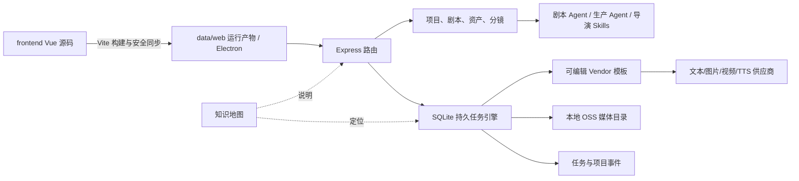

# 架构

```mermaid
flowchart LR
  Source["frontend Vue 源码"] -->|"Vite 构建与安全同步"| UI["data/web 运行产物 / Electron"]
  UI --> API["Express 路由"]
  API --> Domain["项目、剧本、资产、分镜"]
  Domain --> Agent["剧本 Agent / 生产 Agent / 导演 Skills"]
  API --> Queue["SQLite 持久任务引擎"]
  Queue --> Vendor["可编辑 Vendor 模板"]
  Vendor --> Cloud["文本/图片/视频/TTS 供应商"]
  Queue --> Media["本地 OSS 媒体目录"]
  Queue --> Events["任务与项目事件"]
  Knowledge["知识地图"] -.说明.-> API
  Knowledge -.定位.-> Queue
```

当前运行时是 TypeScript/Express/Electron 后端加 Vue 前端，数据库为本地 SQLite。外部参考项目不参与运行。Toonflow-web `9c4cb0e` 已以 subtree 纳入 `frontend/`；`data/web` 仍只是发布产物，不能手工维护。
